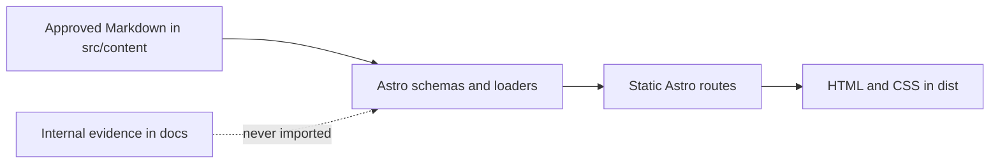

# Technical Architecture

Decision date: 17 September 2026

## Overview

The portfolio is an Astro 7 static site authored in local Markdown. Astro validates content,
generates the homepage, three case-study routes, and a 404 page at build time, and emits ordinary
HTML/CSS to `dist/`. There is no application server, API, database, CMS, or hydrated UI framework.



## Directory structure

```text
src/
├── components/          Small presentational boundaries
├── config/              Public, non-secret site configuration
├── content/
│   ├── case-studies/    Publishable narratives and route metadata
│   └── pages/           Approved page-level copy
├── layouts/             Shared document semantics and metadata shell
├── pages/               File-based static routes
└── styles/              Temporary structural CSS entry point
tests/                    Content and configuration tests
docs/                     Internal evidence and project documentation
```

## Rendering and routes

`output: "static"` is explicit. `/` and `/404.html` are file routes. `/work/[slug].astro` uses
`getStaticPaths()` to generate `logistics-platform`, `fintech-product`, and `saudi-utils` from the
validated collection IDs, ordered by `order`, and renders each body through Astro's content renderer.

## Content flow and boundaries

`src/content.config.ts` separates general approved page copy from case studies. Case studies require
a title, useful description, classification, route, positive order, project, role, an
evidence-bounded diagram, and an internal review note; public links are URL validated. File names are
stable slugs. Tests confirm the expected sources, unique routes and orders, diagram steps, approved
link hosts, and rejection of invalid representative metadata. Internal review notes live in a
validated `internalReview` frontmatter field that is never rendered, because the current Markdown
processor emits HTML comments verbatim into the static output.

`BaseLayout.astro` owns document landmarks and baseline metadata. Page files own routing and data
loading. `CaseStudyList.astro` proves a small typed presentational boundary. `site.ts` holds only
public application configuration; secrets and environment-specific values do not belong there.

## Quality and testing

Prettier formats source, configuration, Markdown, JSON, YAML, and CSS. ESLint applies recommended
JavaScript rules plus strict, type-aware TypeScript rules. `astro check` validates strict TypeScript
and Astro templates. Vitest covers content and configuration invariants. `astro build` is the route
and static-generation integration check. `npm run check` runs non-destructive checks in a fast-fail
order; CI runs it after `npm ci`, then runs the production build.

Later phases own component interaction tests, automated and manual accessibility checks, browser
smoke and end-to-end navigation, visual regression, and measured production performance. Adding
those tools now would test behavior that does not exist.

## Assets and SEO preparation

Static assets will live in `public/` only when they must retain exact names; optimizable authored
images should use Astro's source asset pipeline in later phases. No demo imagery or default assets
exist. The approved CV is served from `public/cv/ali-alaraby-senior-backend-engineer-2026.pdf` and
linked from the validated homepage `cv` field.

The base layout wires titles, descriptions, Open Graph type/title/description, language, charset,
and viewport. Unique approved metadata, canonical URLs, robots, sitemap, structured data, and final
social imagery are Phase 9 responsibilities because the production domain and artwork are not yet
approved.

## Security, dependencies, and deployment

All direct packages are build/development tools; the project has no runtime dependency and ships no
authored client JavaScript. Versions are exact and locked. Node 24 and npm 11 are declared. Secrets,
environment files, output, caches, coverage, and logs are ignored. Dependency changes require a
purpose review, clean install, test/build, and `npm audit`; forced audit fixes are prohibited.

The GitHub Actions workflow has read-only repository permission, pinned action SHAs, npm caching,
`npm ci`, the complete check suite, and a build. Pin updates are reviewed manually against action
release notes. It does not use secrets, write permissions, releases, or deployment.

Static output is compatible with Vercel without an Astro server adapter. This phase does not verify
a remote build, preview deployment, domain, headers, redirects, or production behavior.

### Direct dependency review

Every direct package is development-only; `dependencies` is empty and none adds browser JavaScript.

| Package                                     | Reason and native-alternative review                                                                                                                       |
| ------------------------------------------- | ---------------------------------------------------------------------------------------------------------------------------------------------------------- |
| `astro`                                     | Framework, static generator, Markdown content layer, and Zod schema source; replaces separate router/content/build packages.                               |
| `@astrojs/check`                            | Official Astro template and TypeScript diagnostics; TypeScript alone cannot check `.astro` templates.                                                      |
| `typescript`                                | Strict static typing required by the project; Astro uses it but does not supply the compiler as a project dependency.                                      |
| `@types/node`                               | Types the Node.js APIs used by tests; no runtime code.                                                                                                     |
| `eslint`, `@eslint/js`, `typescript-eslint` | One focused, type-aware lint pipeline; framework lint plugins are intentionally omitted because Astro's checker covers templates.                          |
| `prettier`, `prettier-plugin-astro`         | One formatter for repository text formats; the plugin is required for `.astro` syntax.                                                                     |
| `vitest`                                    | Small test runner compatible with Astro's Vite toolchain; Node's native runner lacks the selected assertion and TypeScript integration without more setup. |

Markdown is formatted by Prettier. A dedicated Markdown linter was evaluated and removed because the
available releases introduced known denial-of-service advisories through parser dependencies; adding
an overlapping vulnerable tool was not justified.

## Non-goals and later phases

This foundation does not include animation, theme switching, analytics, forms, client state,
CMS/API/database infrastructure, final SEO artifacts, deployment, or performance claims.

Phase 5 owned the visual system and responsive shell; Phase 6 the full homepage; Phase 7 the complete
case studies; Phase 8 accessibility and interaction hardening; Phase 9 SEO and sharing; Phase 10
production QA; and Phase 11 deployment and launch verification.

## Phase 5 visual layer

The shared layout now composes semantic header, main, and footer components around each static page.
Small Astro primitives provide action-link, surface-card, and section-shell behavior without a UI
library or browser runtime. Global CSS owns documented design tokens, self-hosted font declarations,
responsive grids, focus states, and reduced-motion behavior. The generated pages contain no authored
client JavaScript; later phases should preserve that baseline unless a concrete interaction requires
progressive enhancement.

## Phase 6 homepage composition

The homepage entry now holds validated structured fields for positioning, proof points, about copy,
selected-work framing, contact copy, and approved profile destinations. The route renders those
fields directly and renders the dedicated capabilities, experience, and open-source Markdown entries
through Astro's content renderer. This keeps each section authoritative in one content file while
allowing the responsive shell to control page hierarchy and presentation.

## Phase 7 case-study composition

`src/pages/work/[slug].astro` renders each case study's full Markdown body inside the prose reading
shell, above a validated metadata panel (classification, project, role, timeline), a content-driven
`FlowDiagram`, optional public-link actions, and previous/next navigation derived from `order`.
`FlowDiagram.astro` is a dependency-free presentational component: diagrams are authored as validated
frontmatter steps drawn strictly from approved copy, so they stay accurate, legible, and
non-confidential without screenshots or proprietary code. Internal review notes are validated but
never rendered. `astro.config.ts` remains unchanged and dependency-free.
